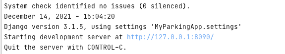

## Setup

The first thing to do is to clone the repository:

```sh
$ git clone https://github.com/JustSayHelloWorld/django_rest_api_parking_app.git
$ cd django_rest_api_parking_app
```

Create a virtual environment to install dependencies in and activate it:

```sh
$ virtualenv2 --no-site-packages env
$ source env/bin/activate
```

Then install the dependencies:

```sh
(env)$ pip install -r requirements.txt
```

Once `pip` has finished downloading the dependencies:

* In order to avoid issues with database run the following commands:
```sh
(env)$ python manage.py makemigrations
(env)$ python manage.py migrate
```
* And then run API on a localhost 8090:
```
(env)$ python manage.py runserver 8090
```
We have specified port for easier way to use request examples provided in [README.md](README.md)

Once use see something like this:



###Now our API is on live.

It is better to Use Postmap App to work with API:
* export [this request collection template](Driver Car Park App.postman_collection.json) into your postman app to work with all available operations
